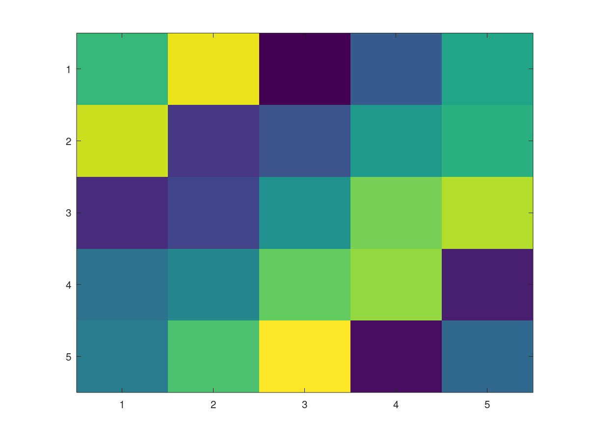
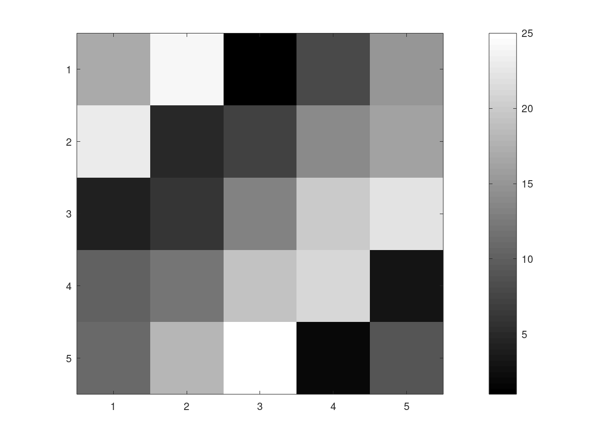

# Octave/Matlab Tutorial Note
## Basic Operations

```matlab
octave:1> 5+6
ans =  11
octave:2> 3-2
ans =  1
octave:3> 5*8
ans =  40
octave:4> 1/2
ans =  0.50000
octave:5> 2^6
ans =  64
octave:6> 1 == 2
ans = 0
octave:7> 1 ~= 2    %True
octave:8> 1 && 0    %AND
ans = 0
octave:9> 1 || 0    %OR
ans = 1
octave:10> xor(1,0)
ans = 1
octave:11> PS1('>> ');
>> a = 3;
>> a = 3
a =  3
>> a = 3;    %semocolon supressing output
>> b = 'hi';
>> b
b = hi
>> c = (3>1);
>> c
c = 1
>> a = pi;
>> a
a =  3.1416
>> disp(a);
 3.1416
>> disp(sprintf('2 decomals: %0.2f', a))
2 decomals: 3.14
>> disp(sprintf('6 decimals: %0.6f', a))
6 decimals: 3.141593
>> a
a =  3.1416
>> format long
>> a
a =  3.141592653589793
>> format short
>> a
a =  3.1416
>> A = [1 2; 3 4; 5 6]    %Matrix expression
A =

   1   2
   3   4
   5   6

>> A = [1 2;
> 3 4;
> 5 6
> ]
A =

   1   2
   3   4
   5   6

>> v = [1 2 3]
v =

   1   2   3

>> v = [1; 2; 3;]
v =

   1
   2
   3

>> v = 1:0.1:2
v =

 Columns 1 through 8:

    1.0000    1.1000    1.2000    1.3000    1.4000    1.5000    1.6000    1.7000

 Columns 9 through 11:

    1.8000    1.9000    2.0000

>> v = 1:6
v =

   1   2   3   4   5   6

>> ones(2,3)
ans =

   1   1   1
   1   1   1

>> C = 2*ones(2,3)
C =

   2   2   2
   2   2   2

>> c = [2 2 2;2 2 2]
c =

   2   2   2
   2   2   2

>> w = ones(1,3)
w =

   1   1   1

>> w = zeros(1,3)
w =

   0   0   0

>> w = rand(1,3)
w =

   0.10425   0.74714   0.56726

>> rand(3,3)
ans =

   0.800421   0.724751   0.021301
   0.947329   0.732448   0.162582
   0.266314   0.832255   0.584233

>> rand(3,3)
ans =

   0.635233   0.949721   0.766935
   0.084009   0.713609   0.075070
   0.343568   0.311012   0.403385

>> w = randn(1,3)
w =

   1.1038780   0.0023379   0.2970299

>> w - randn(1,3)    %related with gaussian distribution
ans =

   1.68353   0.65552  -0.35243

>> w = -6 + sqrt(10)*(randn(1,10000))
w = %gaussian model

>> hist(w)
>> hist(w, 50)
>> eye(4)           %Identity matrix
ans =

Diagonal Matrix

   1   0   0   0
   0   1   0   0
   0   0   1   0
   0   0   0   1

>> % use help command for help
```
---
## Moving Data
```matlab
octave:1> A = [1 2; 3 4; 5 6]
A =

   1   2
   3   4
   5   6

octave:2> size(A)
ans =

   3   2

octave:3> sz = size(A);
octave:4> size(sz)
ans =

   1   2

octave:5> size(A,1)
ans =  3
octave:6> size(A,2)
ans =  2
octave:7> v = [1 2 3 4]
v =

   1   2   3   4

octave:8> length(v)
ans =  4
>> pwd
ans = C:\Octave\Octave-5.2.0\mingw64\bin
>> %cd: move into other directory
>> %ls: listing all packages of current directory
>> %load: load data or function from current directory
>> %load ex) load data.dat or load("data.dat")
>> %who: variables in the current scope
>> %whos: variables, sizes, bytes info in detail in the current scope
>> %save: save file ex. save hello.mat
>>        %save hello.txt v -ascii    %save as text(ASCII)
>> %clear: clear all variables
>> A = [1 2;3 4;5 6;]
A =

   1   2
   3   4
   5   6

>> A(3,2)
ans =  6

>> A(2,:)
ans =

   3   4

>> A(2, :)    %":" means every element along that row/column
ans =

   3   4

>> A([1 3],:)
ans =

   1   2
   5   6

>> A(:,2)
ans =

   2
   4
   6

>> A(:,2)=[10;11;12]
A =

    1   10
    3   11
    5   12

>> A = [A, [100; 101; 102]];    %append another column vector to right
>> A
A =

     1    10   100
     3    11   101
     5    12   102

>> size(A)
ans =

   3   3

>> A(:)
ans =

     1
     3
     5
    10
    11
    12
   100
   101
   102

>> A(:)    %put all elements of A into a single vector
ans =

     1
     3
     5
    10
    11
    12
   100
   101
   102

>> B = [11 12; 13 14; 15 16]
B =

   11   12
   13   14
   15   16

>> A = [1 2; 3 4;5 6]
A =

   1   2
   3   4
   5   6

>> C= [A B]
C =

    1    2   11   12
    3    4   13   14
    5    6   15   16

>> C=[A;B]
C =

    1    2
    3    4
    5    6
   11   12
   13   14
   15   16

>> [A,B]
ans =

    1    2   11   12
    3    4   13   14
    5    6   15   16
```
---
## Computing Data
```matlab
octave:1> A = [1 2;3 4;5 6]
A =

   1   2
   3   4
   5   6

octave:2> B = [11 12; 13 14;15 16]
B =

   11   12
   13   14
   15   16

octave:3> C = [1 1; 2 2]
C =

   1   1
   2   2

>> A .* B
ans =

   11   24
   39   56
   75   96

>> A
A =

   1   2
   3   4
   5   6

>> A .^2
ans =

    1    4
    9   16
   25   36

>> v = [1; 2; 3]
v =

   1
   2
   3

>> log(v)
ans =

   0.00000
   0.69315
   1.09861

>> 1 ./ v     %operate element by element
ans =

   1.00000
   0.50000
   0.33333

>> exp(v)
ans =

    2.7183
    7.3891
   20.0855

>> abs([-1; 2; -3])
ans =

   1
   2
   3

>> -v    %-1*v
ans =

  -1
  -2
  -3

>> v + ones(length(v),1)
ans =

   2
   3
   4

>> length(v)
ans =  3
>> ones(3,1)
ans =

   1
   1
   1

>> v + 1
ans =

   2
   3
   4

>> A
A =

   1   2
   3   4
   5   6

>> A'
ans =

   1   3   5
   2   4   6

>> a = [1 15 2 0.5]
a =

    1.00000   15.00000    2.00000    0.50000

>> val = max(a)
val =  15
>> [val, ind] = max(a)
val =  15
ind =  2
>> max(A)
ans =

   5   6

>> max(A)    %max column value
ans =

   5   6

>> a < 3
ans =

  1  0  1  1

>> find(a<3)    %return index
ans =

   1   3   4

>> A = magic(4)    
% magic square: all sums of rows, columns are same
A =

   16    2    3   13
    5   11   10    8
    9    7    6   12
    4   14   15    1

>> [r,c]=find(A>=7)
r =

   1
   3
   2
   3
   4
   2
   4
   1
   2
   3

c =

   1
   1
   2
   2
   2
   3
   3
   4
   4
   4

>> sum(a
> )
ans =  18.500
>> sum(a)
ans =  18.500
>> prod(a)    %product
ans =  15
>> floor(a)
ans =

    1   15    2    0

>> ceil(a)
ans =

    1   15    2    1

>> rand(3)
ans =

   0.640268   0.096293   0.514272
   0.876811   0.073896   0.808357
   0.999614   0.253966   0.200007

>> max(rand(3), rand(3))
ans =

   0.65556   0.31233   0.73810
   0.21557   0.98870   0.78569
   0.59271   0.87617   0.97388

>> A = magic(3)
A =

   8   1   6
   3   5   7
   4   9   2

>> max(A,[],1)    %max value in each column
ans =

   8   9   7

>> max(A,[],2)    %max value in each row
ans =

   8
   7
   9

>> A(:)
ans =

   8
   3
   4
   1
   5
   9
   6
   7
   2

>> max(A(:))
ans =  9
>> A = magic(9)
A =

   47   58   69   80    1   12   23   34   45
   57   68   79    9   11   22   33   44   46
   67   78    8   10   21   32   43   54   56
   77    7   18   20   31   42   53   55   66
    6   17   19   30   41   52   63   65   76
   16   27   29   40   51   62   64   75    5
   26   28   39   50   61   72   74    4   15
   36   38   49   60   71   73    3   14   25
   37   48   59   70   81    2   13   24   35

>> sum(A,1)
ans =

   369   369   369   369   369   369   369   369   369

>> sum(A,2)
ans =

   369
   369
   369
   369
   369
   369
   369
   369
   369

>> eye(9)
ans =

Diagonal Matrix

   1   0   0   0   0   0   0   0   0
   0   1   0   0   0   0   0   0   0
   0   0   1   0   0   0   0   0   0
   0   0   0   1   0   0   0   0   0
   0   0   0   0   1   0   0   0   0
   0   0   0   0   0   1   0   0   0
   0   0   0   0   0   0   1   0   0
   0   0   0   0   0   0   0   1   0
   0   0   0   0   0   0   0   0   1


>> A .* eye(9)
ans =

   47    0    0    0    0    0    0    0    0
    0   68    0    0    0    0    0    0    0
    0    0    8    0    0    0    0    0    0
    0    0    0   20    0    0    0    0    0
    0    0    0    0   41    0    0    0    0
    0    0    0    0    0   62    0    0    0
    0    0    0    0    0    0   74    0    0
    0    0    0    0    0    0    0   14    0
    0    0    0    0    0    0    0    0   35

>> sum(sum(A.*eye(9)))
ans =  369
>> sum(sum(A.*flipud(eye(9))))
ans =  369
>> flipud(eye(9))
ans =

Permutation Matrix

   0   0   0   0   0   0   0   0   1
   0   0   0   0   0   0   0   1   0
   0   0   0   0   0   0   1   0   0
   0   0   0   0   0   1   0   0   0
   0   0   0   0   1   0   0   0   0
   0   0   0   1   0   0   0   0   0
   0   0   1   0   0   0   0   0   0
   0   1   0   0   0   0   0   0   0
   1   0   0   0   0   0   0   0   0

>> A=magic(3)
A =

   8   1   6
   3   5   7
   4   9   2

>> pinv(A)    %psuedo inverse
ans =

   0.147222  -0.144444   0.063889
  -0.061111   0.022222   0.105556
  -0.019444   0.188889  -0.102778

>> temp = pinv(A)
temp =

   0.147222  -0.144444   0.063889
  -0.061111   0.022222   0.105556
  -0.019444   0.188889  -0.102778

>> temp * A
ans =

   1.0000e+00   2.0817e-16  -3.1641e-15
  -6.1062e-15   1.0000e+00   6.2450e-15
   3.0531e-15   4.1633e-17   1.0000e+00
```

## Plotting Data
<p>
<p align = "center">
</img>
</p>

```matlab
>> t = [0:0.01:0.98];
>> y1 = sin(2*pi*4*t);
>> plot(t,y1);
>> y2 = cos(2*pi*4*t);
>> plot(t,y2);
>> plot(t,y1);
>> hold on      % Plot simutaneously
>> plot(t, y2, 'r');
>> xlabel('time')
>> ylabel('value')
>> legend('sin', 'cos');
>> title('my plot');
>> pwd
ans = C:\Octave\Octave-5.2.0\mingw64\bin
>> cd C:/Users/user/Desktop; print -dpng 'myPlot.png'
```

<p>
<p align = "center">
</img>
</p>

```matlab
>> figure(1); plot(t, y1);
>> figure(2); plot(t, y2);
>> subplot(1,2,1); plot(t,y1);    %Divides plot a 1x2 grid, access first element
>> hold on
>> subplot(1,2,2); plot(t,y2);
>> axis([0.5 1 -1 1])
>> clf      %clear figure

```
<p>
<p align = "center">
</img>
</p>

```matlab
>> A = magic(5)
A =

   17   24    1    8   15
   23    5    7   14   16
    4    6   13   20   22
   10   12   19   21    3
   11   18   25    2    9

>> imagesc(A)
```
<p>
<p align = "center">
</img>
</p>

```matlab
>> imagesc(A), colorbar, colormap gray;
>> A(1,2)
ans =  24
>> A(4,5)
ans =  3
>> imagesc(magic(15)), colorbar, colormap gray;
>> a = 1, b = 2, c = 3      %,: comma chaining
a =  1
b =  2
c =  3
```
---
## Control Statements
```matlab
>> v = zeros(10, 1);
>> for i=1:10.
> end;
>> for i=1:10,
> v(i) = 2^i;
> end;
>> v
v =

      2
      4
      8
     16
     32
     64
    128
    256
    512
   1024

>> i=1;
>> while i <= 5,
> v(i) = 100;
> i = i+1;
> end;
>> v
v =

    100
    100
    100
    100
    100
     64
    128
    256
    512
   1024

>> i=1;
>> while true,
> v(i) = 999;
> i=i+1;
> if i == 6,
> break;
> end;
> end;
>> v
v =

    999
    999
    999
    999
    999
     64
    128
    256
    512
   1024

>> v(1)=2;
>> if v(1) == 1,
> disp('The value is one');
> elseif v(1) == 2,
> disp('The value is two');
> else
> disp('The value is not one or rwo');
> end;
The value is two

>> % We can apply function from any directory
>> % addpath("FUNCTION.M PARENT DIRECTORY") : Octave search path
```